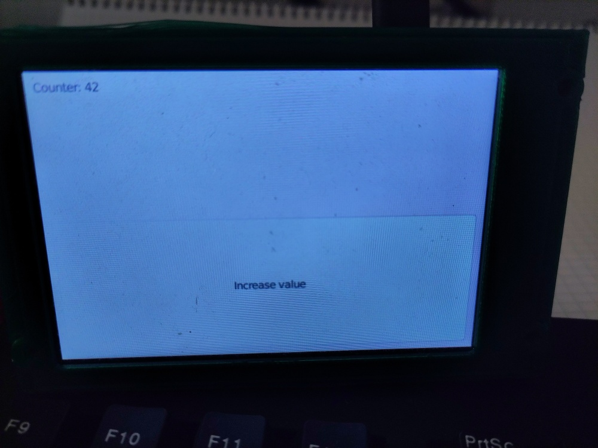

# Slint framebuffer example

⚠️⚠️⚠️

This example is very rudimentary. It may not work with all framebuffer drivers (in fact, with most it won't, because it uses 16-bit pixels, assuming the driver will understand).
Use at your own risk, and be ready to reboot if your screen is frozen 🙈

⚠️⚠️⚠️

## What is this?

This example contains a very simple slint [Platform](https://docs.rs/slint/latest/slint/platform/trait.Platform.html) implementation, that renders to a Linux framebuffer device.

Slint is a UI library written in Rust. Learn more about it at https://slint.dev

The example uses single-buffered rendering (double-buffer would be supported by the framebuffer API, however it's not supported by all drivers - especially the `fbtft` driver [does not support it](https://github.com/notro/fbtft/issues/401)).

## How to use

1. Open `main.rs` and make sure the `tty_path` and `fb_path` values match your system.
2. Compile & run, with `cargo run`

Note that touch input is not implemented.

## Why?

I wanted to see how adding a custom platform implementation works (the process went very smooth, thanks to [excellent upstream documentation](https://docs.rs/slint/latest/slint/docs/mcu/index.html))

## Does it work?

Maybe.

Below is a picture of how it looks on a 4-inch waveshare display, on the RaspberryPi. Note that this display is connected via SPI and controlled via the `fbtft` driver. It's not using the RaspberryPi's builtin graphics hardware. If you have a proper display, connected via HDMI or the built-in display connector, using a wayland compositor or X server, as well as an accelerated renderer would be the better choice imho.

